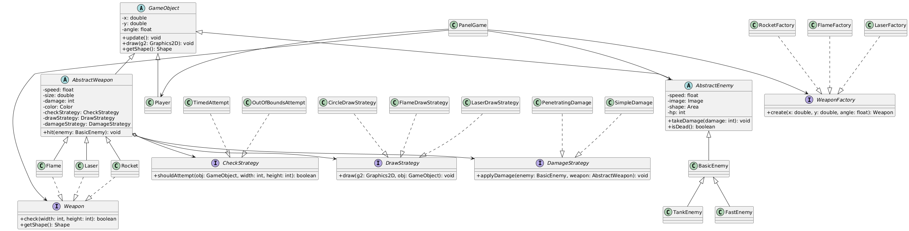

# Sky Defender

## Meno a priezvisko
**Hlib Kalyta**

## Meno cviciaceho
**Anna Povazanova**

## Názov a zámer projektu
**Sky Defender** je 2D arkádová strieľačka z pohľadu zhora.  
Cieľom projektu je demonštrovať princípy objektovo-orientovaného programovania
(enkapsulácia, dedičnosť, polymorfizmus, abstrakcia) vo forme kompletnej hry,
ktorá preverí hráčove reflexy, stratégie výberu zbraní a schopnosť prežiť
neustále silnejúce vlny nepriateľov.

## Žáner hry
Top-down akčná strieľačka (arcade shoot ’em up).

## Herné mechaniky
* **Vlny nepriateľov** – každých 10 bodov sa spustí nová, ťažšia vlna  
  (Basic → Fast → Tank drony).
* **Tri typy zbraní**
    * **Rakety (J)** – priame výbuchy s vysokým dmg.
    * **Plameňomet (K)** – široký kužeľ, preniká viacerými cieľmi.
    * **Laser (L)** – úzky, dlhý lúč, okamžitý zásah.
* **Skóre a rekord** – každý zničený dron = +1 bod; najlepší výsledok sa
  ukladá, zobrazuje v menu a na HUD.
* **Zdravie lietadla** – 100 HP; zrážka s dronom –50 HP; nulové HP = Game Over.

## Ovládanie
| Kláves | Funkcia |
|:------:|---------|
| **A / D** | Otočenie lietadla vľavo / vpravo |
| **SPACE** | Pridanie plynu (akcelerácia) |
| **J / K / L** | Streľba vybranou zbraňou |
| **ENTER** | Spustenie hry (z menu) |
| **P** | Pauza / pokračovanie |
| **S / X** | Uloženie / načítanie hry |
| **ESC** | Ukončenie aplikácie |

## Herné stavy
1. **Main Menu** – štart, zobrazenie rekordu, odkaz na „How to Play“.
2. **Manual** – stručný prehľad ovládania a cieľov.
3. **Playing** – aktívna hra, HUD so skóre a zdravím.
4. **Paused** – polopriehľadný overlay s nápisom *PAUSED*.
5. **Game Over** – výsledné skóre, ponuka *Restart* / *Exit*.

## Ukladanie a načítanie
Stlačením **S** sa uloží stav (skóre, vlna, HP, poloha hráča, zoznam
nepriateľov a projektilov, zvolená zbraň, high-score) do súboru `save.txt`.
Stlačením **X** sa posledný save načíta.

## Hodnotenie hráča
* **HUD**: aktuálne skóre, best score, dynamický HP-bar (zelená → žltá → červená).
* **Wave Text**: po štarte novej vlny sa na 2 s zobrazí „WAVE N“.

## Diagram hierarchie tried

## Vyjadrenie sa k splneniu podmienok

### Nutné podmienky

| #     | Podmienka | Detailné vysvetlenie splnenia |
|-------|-----------|--------------------------------|
| **1** | Funkčnosť a zhoda so zadaním | Spustením triedy **main.core.game_loop.Main** sa zobrazí hlavné menu, hráč môže prepnúť na **PlayingState**, ničiť nepriateľov a po vyčerpaní HP sa zobrazuje **GameOverState**. Tým je naplnený žáner „2D arkádová strieľačka s vlnami nepriateľov“. |
| **2** | Dedičnosť a rozhrania | Hierarchia `GameObject → Player / AbstractEnemy / AbstractWeapon`; rozhrania `Updatable`, `Drawable`, `Weapon` definujú kontrakty, ktoré implementujú konkrétne triedy. |
| **3** | Externé závislosti cez Maven | Projekt využíva Maven na správu závislostí. V súbore pom.xml je pridaná jediná externá knižnica: JUnit 5 (org.junit.jupiter) pre písanie a spúšťanie jednotkových testov. Neexistujú žiadne ručne pridané .jar súbory v repozitári. |
| **4** | OOP princípy | *Abstrakcia*: `GameObject` skrýva súradnice a poskytuje rozhranie.  *Enkapsulácia*: polia sú `private`, prístup len cez metódy.  *Polymorfizmus*: metóda `draw()` sa volá nad `List<AbstractEnemy>` a v runtime sa vykoná verzia `BasicEnemy` / `FastEnemy` / `TankEnemy`. |
| **5** | JavaDoc & komentáre | Každá verejná trieda a public metóda (napr. `GameUpdater#update`) má JavaDoc popis parametrov a účelu; kľúčové bloky kódu obsahujú inline komentáre. |
| **6** | Unit testy > 80 % | Dá sa to overiť pravým kliknutím na priečinok src a výberom možnosti Run with Coverage (v mojom projekte je line coverage 88 %). |
| **7** | Zásady softvérového vývoja | Kód je rozdelený do balíkov (`main.core`, `main.core.data`, `main.render`, `main.service`), používa logging (`java.util.logging`), vlastné výnimky. |

### Ďalšie (bonusové) kritériá

| Kritérium | Kde a ako je využité |
|-----------|----------------------|
| **Návrhové vzory** | *Factory*: Triedy ako `RocketFactory`, `EnemyFactoryRegister` generuju  nové objekty.  *Strategy*: Dynamická výmena správania zbraní  (`DrawStrategy`, `DamageStrategy`, `CheckStrategy`).  *State Pattern*: Rôzne stavy hry (`MainMenuState`, `PlayingState`, `PausedState`, `GameOverState`) sú implementované pomocou rozhrania `IGameState` a dynamicky sa menia v `GameStateManager`.
| **Logovanie** | Info/warning/error v `GameUpdater`, `SaveManager`, `HighScoreManager` 
| **Vlastné výnimky** | `GameSaveException`, `GameLoadException` pri práci so súborom 
| **GUI (Swing)** | `PanelGame` vykresľuje do `BufferedImage`, používateľské ovládanie cez `KeyListener` a `MouseListener` 
| **Viacvláknovosť** | Herná slučka `GameLoop` beží v oddelenom vlákne; asynchrónne ukladanie hry (`SaveManager.asyncSave`) 
| **Generiká** | `EnemyFactoryRegister<T>` s mapou `Map<EnemyType, EnemyFactory<T>>` 
| **Lambda / method reference** | `SwingUtilities.invokeLater(panel::repaint)` 
| **Serializácia / IO** | Trieda `SaveData` je `Serializable`, ukladá sa binárne cez `ObjectOutputStream` 

## Spustenie
Program je spustiteľný cez Main.java.  
Vyžaduje JDK 21 a IDE ako IntelliJ IDEA alebo Eclipse.

### Postup:
1. Otvorte projekt v IntelliJ IDEA (File → Open → vybrať priečinok projektu).
2. Skontrolujte, že projekt používa JDK 21 (File → Project Structure → Project SDK).
3. IntelliJ automaticky načíta Maven závislosti z `pom.xml`.
4. Spustite hru cez triedu `Main` (v balíku `main.core.game_loop`) kliknutím pravým tlačidlom → **Run 'Main.main()'**.
5. (Voliteľné) Spustite unit testy cez pravý klik na `src/test/java` → **Run tests with coverage**.
