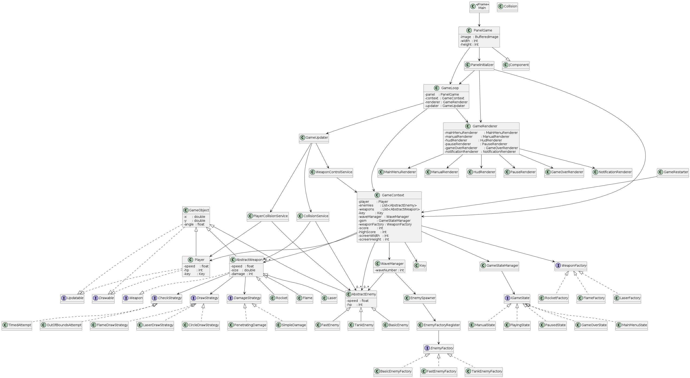

# Sky Defender

## Meno a priezvisko
**Hlib Kalyta**

## Názov a zámer projektu
**Sky Defender** je 2D arkádová strieľačka, kde hráč ovláda lietadlo, ničí nepriateľské jednotky a prežíva vlny útokov.  
Projekt je vytvorený ako semestrálna práca na predmet Objektovo-orientované programovanie.  

## Zhodnotenie OOP čŕt

Program spĺňa všetky požiadavky na objektovo-orientovaný návrh:

###  Zapuzdrenie (Encapsulation)
- Všetky triedy používajú súkromné (private) alebo chránené (protected) premenné s verejnými get/set metódami.
- Triedy `Player`, `AbstractEnemy`, `AbstractWeapon` obsahujú inkapsulované vlastnosti ako `hp`, `speed`, `image`.

###  Dedenie (Inheritance)
- `GameObject` je abstraktná trieda, ktorú rozširujú `Player`, `AbstractEnemy`, `AbstractWeapon`.
- `AbstractEnemy` je ďalej rozšírený o `BasicEnemy`, `FastEnemy`, `TankEnemy`.

###  Polymorfizmus (Polymorphism)
- Všetky objekty nepriateľov sú spracovávané ako `AbstractEnemy`.
- Zbrane sú vytvárané pomocou rozhrania `Weapon` a používajú polymorfné metódy `draw()` a `hit()` cez stratégiu.

###  Abstrakcia (Abstraction)
- Triedy `AbstractEnemy`, `AbstractWeapon`, `GameObject` definujú abstraktné rozhranie pre svoje potomky.
- Hráč (Player) nemusí vedieť, ako zbraň funguje — iba ju používa cez rozhranie `Weapon`.

---

## Pokrytie testami
- Triedy `Player`, `Rocket`, `Flame`, `Laser`, `Collision`, `BasicEnemy` boli pokryté unit testami.
- Testovanie bolo vykonané pomocou JUnit 5.

---

## Spustenie
Program je spustiteľný cez `Main.java`.  
Vyžaduje JDK 17 a IDE ako IntelliJ IDEA alebo Eclipse.

---

## Poznámka
Program obsahuje hlavné menu, manuál, spracovanie myši, skóre, životy, rôzne typy nepriateľov, vlny, a návrhové vzory (Strategy + Factory).

## Diagram hierarchie tried
